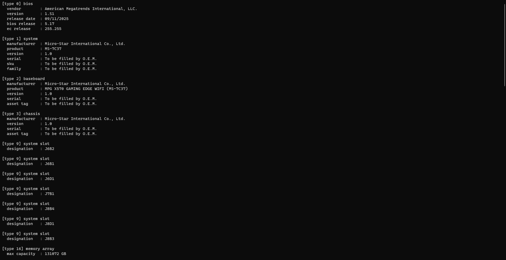
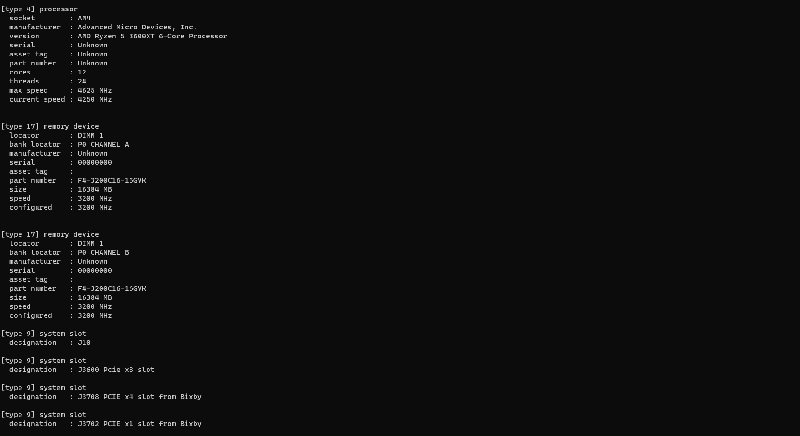

Header-only C++ library for parsing SMBIOS firmware tables on Windows.

## why?

Windows exposes SMBIOS data through `GetSystemFirmwareTable` but parsing the
raw blob correctly is more annoying than it should be. most implementations
either ignore the string section entirely or index into it wrong. this library
handles it properly and gives you typed structs for every common table type
with zero dependencies.

**pros:**
- header-only, just drop it in
- no dependencies
- correctly handles the SMBIOS string section
- typed structs for all common table types
- works from any usermode process, no driver needed

**cons:**
- Windows only
- usermode only

## showcase




## usage

include `smbios/smbios.hpp` in your project. call `fetch()` to get the raw
blob, then `walk_structures()` to iterate over every table. cast to the
typed struct after checking the type field.

```cpp
#include <smbios/smbios.hpp>

auto buffer = smbios::fetch();

smbios::walk_structures(buffer, [](const smbios::header* hdr)
{
    if (hdr->type == 1)
    {
        auto* s = reinterpret_cast<const smbios::system_info*>(hdr);
        printf("product : %s\n", smbios::get_string(hdr, s->product_name));
        printf("serial  : %s\n", smbios::get_string(hdr, s->serial_number));
    }
});
```

## supported types

| type | name                        |
|------|-----------------------------|
| 0    | bios information            |
| 1    | system information          |
| 2    | baseboard information       |
| 3    | chassis information         |
| 4    | processor information       |
| 7    | cache information           |
| 9    | system slots                |
| 16   | physical memory array       |
| 17   | memory device               |
| 19   | memory array mapped address |


